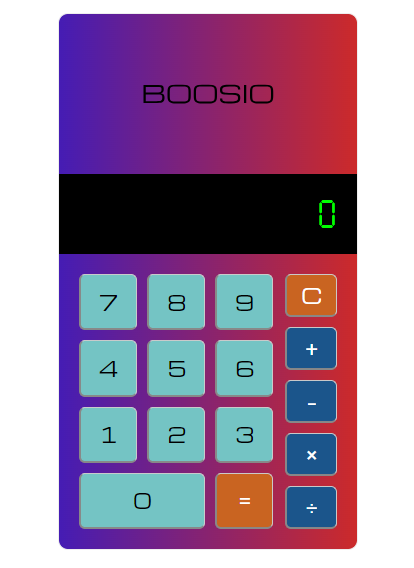

# 🎉 Simple Calculator Project 🎉

Welcome to the **Simple Calculator Project**! This project is a basic calculator built with HTML, CSS, and JavaScript. It's a perfect starting point for anyone looking to get into web development and have some fun with coding! 🖥️✨

## 🚀 Features

- **Basic Arithmetic Operations**: Add, subtract, multiply, and divide with ease! ➕➖✖️➗
- **Clear Function**: Start fresh with the clear button. 🧼
- **Responsive Design**: Works perfectly on all devices, from desktop to mobile. 📱💻

## 📸 Screenshots

Check out how cool our calculator looks!

## 🛠️ Technologies Used

- **HTML5**: The backbone of our structure. 🏗️
- **CSS3**: Styling it up! 🎨
- **JavaScript**: Making it functional. 🧠

## 🎯 How to Use

1. **Clone the Repository**: `git clone https://github.com/gianlivio/js-simple-calculator.git`
2. **Navigate to the Directory**: `cd js-simple-calculator`
3. **Open `index.html` in Your Browser**: Simply open the file and start calculating! 🌐

## 🤓 Highlights

- **Intuitive UI/UX Design**: The interface is clean and user-friendly, making it easy to perform calculations.
- **Event Handling with JavaScript**: Efficiently handles user inputs and performs real-time calculations.
- **Modular Code Structure**: The JavaScript code is well-organized into functions for clarity and maintainability.
- **Responsive Layout**: Uses CSS Grid for a layout that adjusts beautifully across different screen sizes.
